# Pet Adoption Platform

## Project Overview
The Pet Adoption Platform is designed for efficient pet adoption and management, featuring a robust front-end built with React and a back-end using Node.js and MySQL. This platform caters to both regular users and administrators, offering functionalities like pet adoption, fostering, user and pet profile management, and an AI-powered admin tool for advanced database querying.

## Table of Contents
- [Getting Started](#getting-started)
- [App Features](#app-features)
- [Setup / Installation](#setup--installation)
- [Running the Application](#running-the-application)
- [Site Features](#site-features)
- [License](#license)

## Getting Started
This section provides instructions on how to get the project up and running on your local machine for development and testing purposes.

## Setup / Installation
Follow these steps to set up the project locally:

1. Clone the repository.
2. Navigate to the client directory and install dependencies.
3. Navigate to the server directory and install dependencies.

## Running the Application
1. To start the server.
2. To start the client in a new terminal window.

## Site Features
### Log in / Sign in
[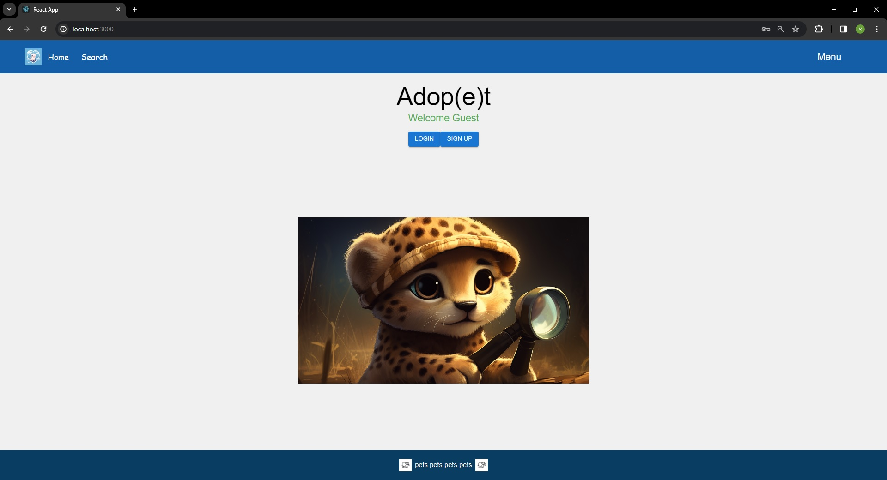](https://pakatanks.web.app/)
[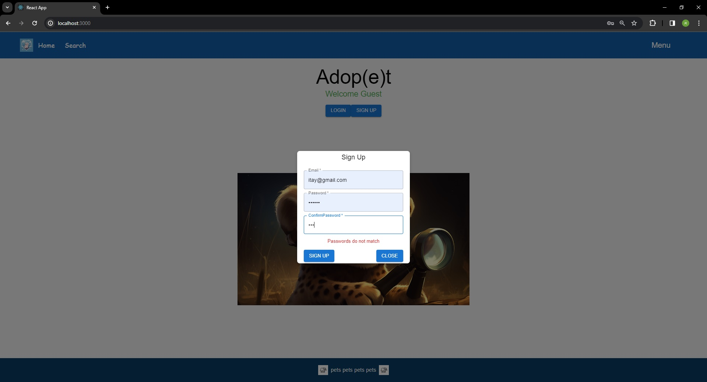](https://pakatanks.web.app/)

### User Profile
[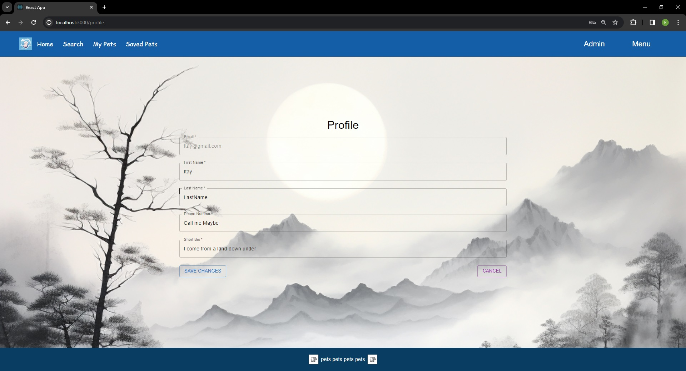](https://pakatanks.web.app/)

### Pet Full Card
[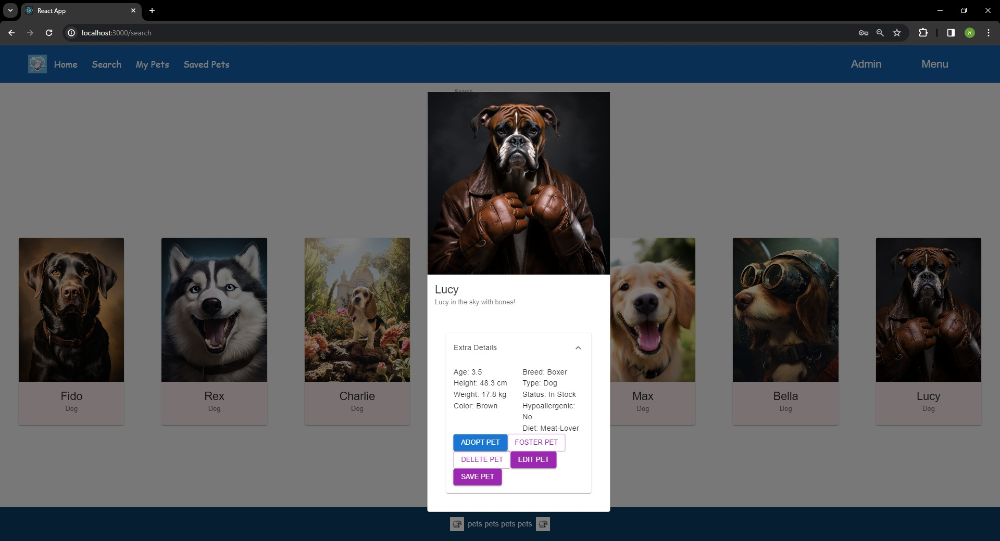](https://pakatanks.web.app/)

### Homepage
[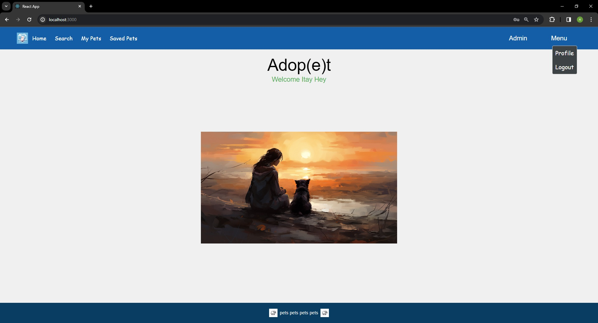](https://pakatanks.web.app/)

### Admin Dashboard
[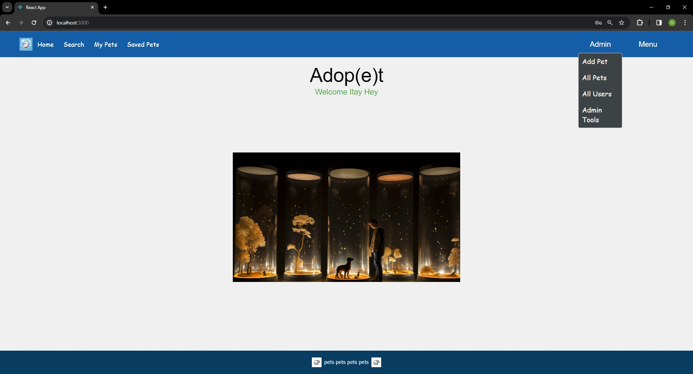](https://pakatanks.web.app/)

### Search
[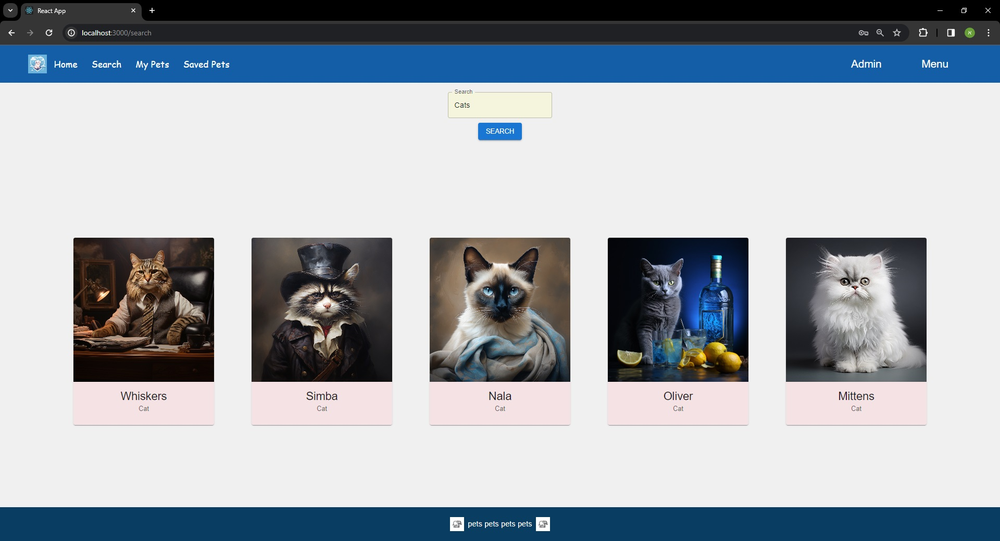](https://pakatanks.web.app/)
[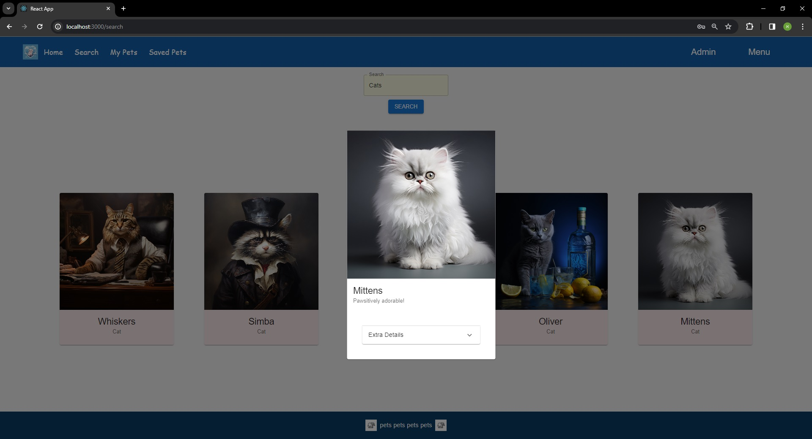](https://pakatanks.web.app/)

### My Pets
[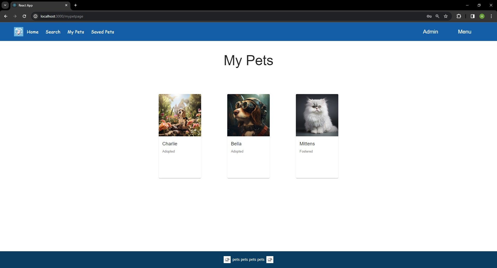](https://pakatanks.web.app/)

### Saved Pets
[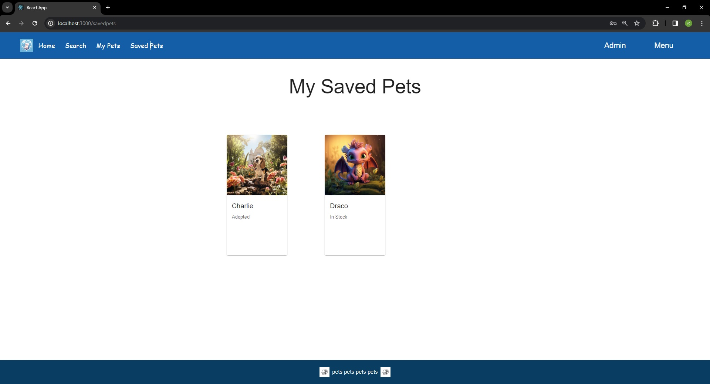](https://pakatanks.web.app/)

### Add Pet
[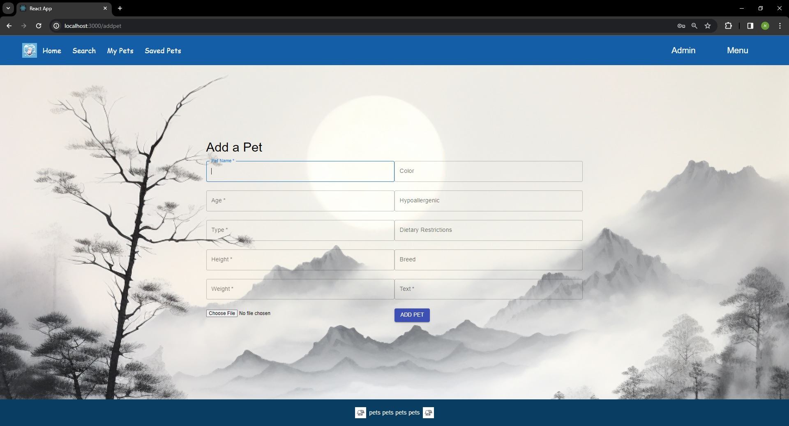](https://pakatanks.web.app/)

### All Pets
[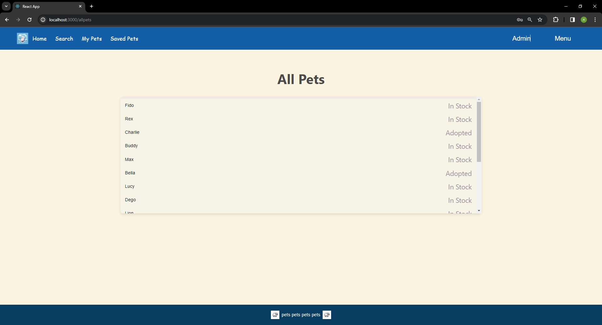](https://pakatanks.web.app/)
[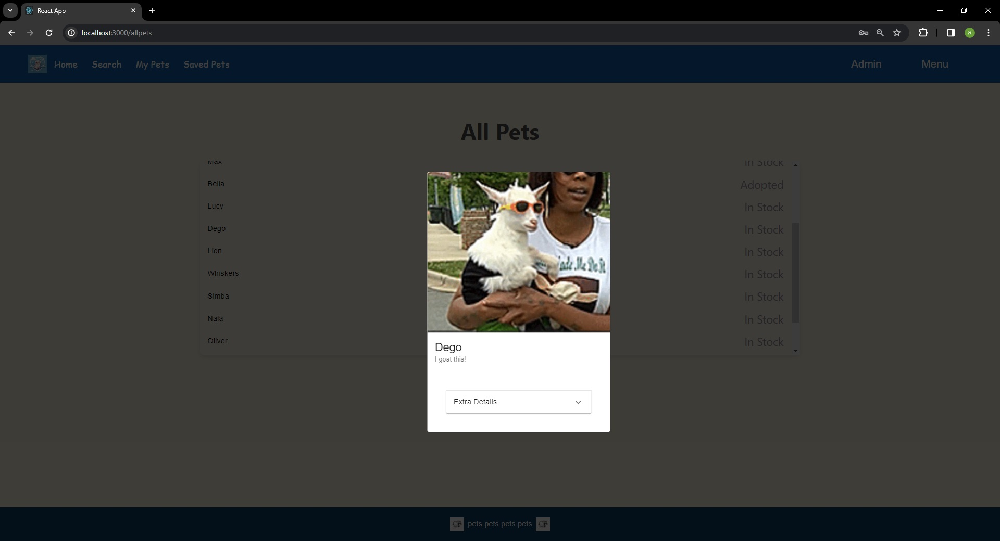](https://pakatanks.web.app/)

### All Users
[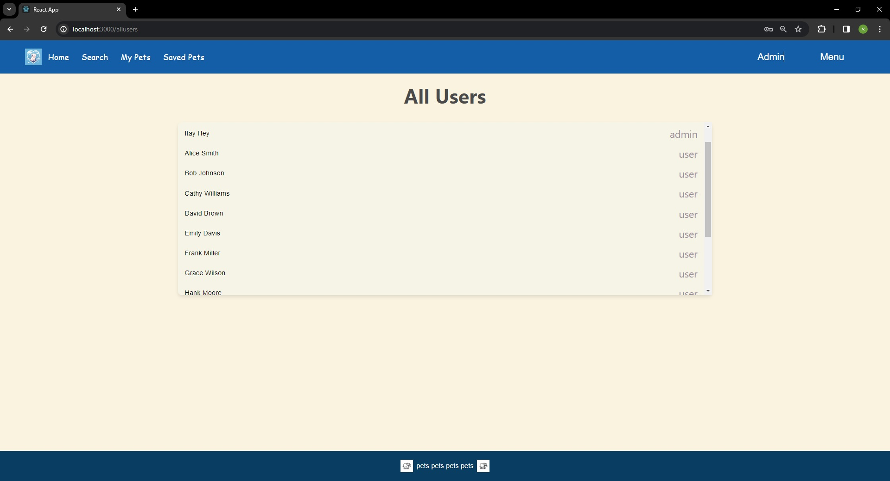](https://pakatanks.web.app/)
[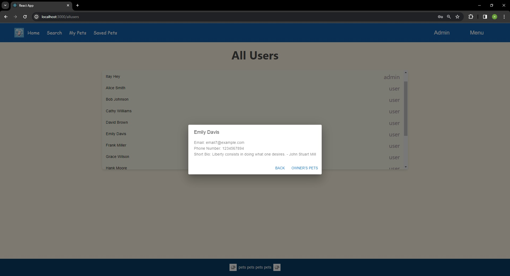](https://pakatanks.web.app/)

### User's Pets
[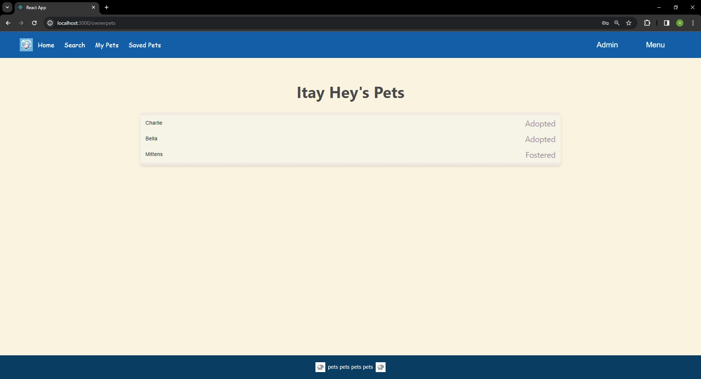](https://pakatanks.web.app/)

### Admin Tools
[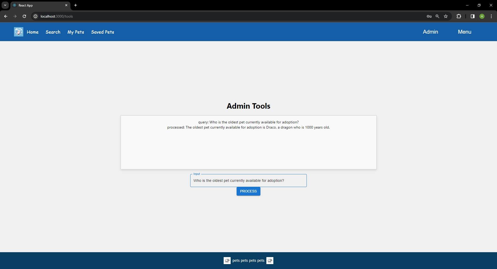](https://pakatanks.web.app/)

## License
This project is licensed under the MIT License - see the [LICENSE.md](LICENSE) file for details.

### Additional Notes
To use this application, you'll need an API token and access to the database. Make sure to set up these credentials before running the application.
